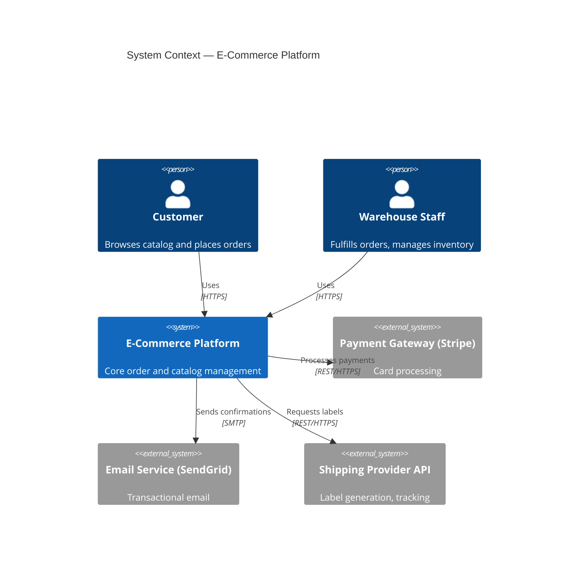
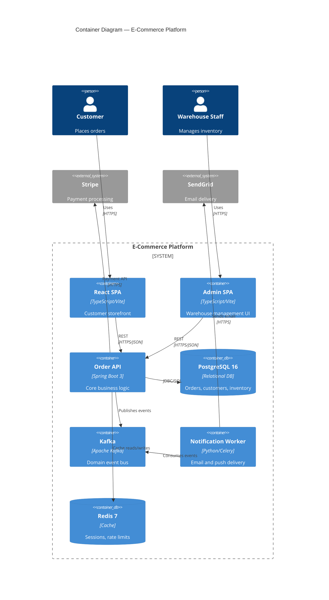

# C4 Model — Architecture Diagramming

Simon Brown's C4 Model gives a common vocabulary for describing software architecture at four levels of abstraction. The key insight: different audiences need different zoom levels. One diagram does not serve all.

## The Four Levels of Abstraction

```
ZOOM OUT ──────────────────────────────────────────────── ZOOM IN

Level 1: System Context
  "What does this system do and who uses it?"
  Audience: PMs, business stakeholders, new joiners
  No tech details.

    Level 2: Container
      "What are the deployable units and how do they communicate?"
      Audience: Developers, architects, DevOps
      Technology is visible here.

        Level 3: Component
          "What are the major building blocks inside a container?"
          Audience: Developers working on that container
          Maps to packages / modules / namespaces.

            Level 4: Code (optional)
              "What do the classes/functions look like?"
              Audience: Developers; usually auto-generated from IDE
              Only draw manually for complex algorithms or onboarding.
```

---

## Level 1 — System Context Diagram

### Purpose
Show the system in the center, the humans who use it, and the external systems it integrates with. No technology, no internals.

**Key question:** "What does this system do and who uses it?"

**What NOT to show:**
- Technology choices (no "React", "PostgreSQL", "Kafka" here)
- Internal structure (no services, modules, or components)
- Implementation details of any kind

**Notation:**
```
[Person]          Stick-figure shape. Someone who uses the system.
[Software System] Box. The system you are describing OR an external one.
[Relationship]    Labeled arrow. What data/interaction flows, and why.
```

### ASCII Example: E-Commerce System Context

```
         +------------------+
         |    <<Person>>    |
         |    Customer      |
         | Browses catalog, |
         | places orders    |
         +--------+---------+
                  |
                  | Uses (HTTPS)
                  v
         +------------------+         +-------------------------+
         | <<Software Sys>> |         | <<Software System>>     |
         |  E-Commerce      +-------->| Payment Gateway (Stripe)|
         |  Platform        | Charges | Handles card processing |
         |                  | via API |                         |
         +--------+---------+         +-------------------------+
                  |
                  | Sends order confirmations via
                  v
         +------------------+
         | <<Software Sys>> |
         |  Email Service   |
         |  (SendGrid)      |
         +------------------+

         <<Person>>
         Warehouse Staff
         Fulfills orders, updates
         stock levels
              |
              | Uses (HTTPS)
              v
         [E-Commerce Platform]  (same system, different actor)
```

### PlantUML — System Context

```plantuml
@startuml C4_Context_ECommerce
!include https://raw.githubusercontent.com/plantuml-stdlib/C4-PlantUML/master/C4_Context.puml

LAYOUT_WITH_LEGEND()

title System Context — E-Commerce Platform

Person(customer, "Customer", "Browses the catalog and places orders online.")
Person(warehouse, "Warehouse Staff", "Fulfills orders and manages inventory.")

System(ecommerce, "E-Commerce Platform", "Allows customers to browse products, place orders, and track deliveries.")

System_Ext(payment, "Payment Gateway", "Handles payment processing via Stripe API.")
System_Ext(email, "Email Service", "Sends transactional emails via SendGrid.")
System_Ext(shipping, "Shipping Provider API", "FedEx/UPS integration for label generation and tracking.")

Rel(customer, ecommerce, "Uses", "HTTPS")
Rel(warehouse, ecommerce, "Uses", "HTTPS")
Rel(ecommerce, payment, "Processes payments via", "HTTPS/REST")
Rel(ecommerce, email, "Sends order confirmations via", "HTTPS/SMTP")
Rel(ecommerce, shipping, "Generates labels and tracks shipments via", "HTTPS/REST")

@enduml
```

### Mermaid — System Context



---

## Level 2 — Container Diagram

### Purpose
Zoom into the system. Show every separately deployable/runnable unit: web apps, APIs, mobile apps, databases, message brokers, CDNs, background workers.

**Key question:** "What are the high-level technology decisions and how do containers communicate?"

**Technology is visible here.** "Spring Boot API" not just "API". "PostgreSQL 16" not just "Database".

**What counts as a container:**
- Web application (React SPA, Next.js server)
- API (Spring Boot, FastAPI, Express)
- Database (PostgreSQL, MongoDB, Redis)
- Message broker (Kafka cluster, RabbitMQ)
- Background worker / job runner
- Mobile app (iOS, Android)
- Static file CDN / object storage

**Notation:**
```
[Container]       Box with technology label in brackets: [Spring Boot]
[Person]          Same as Context level
[Ext System]      Same as Context level — treated as a black box
[Relationship]    Arrow with: what is exchanged + protocol
```

### ASCII Example: E-Commerce Container Diagram

```
  Customer                            Warehouse Staff
  <<Person>>                          <<Person>>
      |                                    |
      | HTTPS                              | HTTPS
      v                                    v
+---------------------+        +---------------------+
| <<Container>>       |        | <<Container>>       |
| React SPA           |        | React Admin SPA     |
| [TypeScript/Vite]   |        | [TypeScript/Vite]   |
| Customer-facing     |        | Inventory & order   |
| storefront          |        | management UI       |
+----------+----------+        +----------+----------+
           |                             |
           | REST/HTTPS (JSON)           | REST/HTTPS (JSON)
           v                             v
+----------------------------------------------------+
|              <<Container>>                         |
|              Order API                             |
|              [Spring Boot 3, Java 21]              |
|   Handles catalog, orders, auth, inventory.        |
+---+----------------+------------------+------------+
    |                |                  |
    | SQL/JDBC        | Publishes events | Reads/Writes
    v                v                  v
+----------+  +------------------+  +-----------+
|<<Contain>>| | <<Container>>    |  |<<Contain>>|
| PostgreSQL| | Kafka Cluster    |  | Redis      |
| [v16]     | | [Apache Kafka]   |  | [v7]       |
| Orders,   | | order.placed,    |  | Session    |
| customers,| | order.shipped    |  | cache,     |
| inventory | | events           |  | rate limit |
+-----------+ +--------+---------+  +-----------+
                       |
                       | Consumes events
                       v
              +------------------+
              | <<Container>>    |
              | Notification     |
              | Worker           |
              | [Python/Celery]  |
              | Sends emails and |
              | push notifs      |
              +------------------+
                       |
                       | SMTP / FCM
                       v
              [SendGrid]   [Firebase Cloud Messaging]
              <<Ext Sys>>  <<Ext Sys>>
```

### PlantUML — Container Diagram

```plantuml
@startuml C4_Container_ECommerce
!include https://raw.githubusercontent.com/plantuml-stdlib/C4-PlantUML/master/C4_Container.puml

LAYOUT_WITH_LEGEND()

title Container Diagram — E-Commerce Platform

Person(customer, "Customer", "Places orders online.")
Person(warehouse, "Warehouse Staff", "Manages inventory and fulfillment.")

System_Boundary(ecommerce, "E-Commerce Platform") {
    Container(spa, "React SPA", "TypeScript, Vite", "Customer storefront. Catalog browsing, cart, checkout.")
    Container(admin_spa, "Admin SPA", "TypeScript, Vite", "Inventory and order management for warehouse staff.")
    Container(api, "Order API", "Spring Boot 3, Java 21", "Core business logic: catalog, orders, auth, inventory.")
    ContainerDb(db, "Order Database", "PostgreSQL 16", "Stores orders, customers, products, inventory.")
    Container(broker, "Message Broker", "Apache Kafka", "Publishes domain events: order.placed, order.shipped.")
    Container(worker, "Notification Worker", "Python, Celery", "Consumes Kafka events. Sends emails and push notifications.")
    ContainerDb(cache, "Cache", "Redis 7", "Session store, rate limiting, catalog cache.")
}

System_Ext(payment, "Stripe", "Payment processing.")
System_Ext(email, "SendGrid", "Transactional email delivery.")
System_Ext(push, "Firebase Cloud Messaging", "Mobile push notifications.")

Rel(customer, spa, "Uses", "HTTPS")
Rel(warehouse, admin_spa, "Uses", "HTTPS")
Rel(spa, api, "Calls", "REST/HTTPS, JSON")
Rel(admin_spa, api, "Calls", "REST/HTTPS, JSON")
Rel(api, db, "Reads/writes", "JDBC/SQL")
Rel(api, cache, "Reads/writes", "Redis protocol")
Rel(api, broker, "Publishes events to", "Kafka protocol")
Rel(api, payment, "Processes payments via", "REST/HTTPS")
Rel(worker, broker, "Consumes events from", "Kafka protocol")
Rel(worker, email, "Sends emails via", "SMTP/HTTPS")
Rel(worker, push, "Sends push notifications via", "FCM REST API")

@enduml
```

### Mermaid — Container Diagram



---

## Level 3 — Component Diagram

### Purpose
Zoom into a single container and show its major logical components. A component maps to a package, namespace, or module — not a single class.

**Key question:** "What are the major components inside this container and what are their responsibilities?"

**Audience:** Developers actively working on that specific container.

**Natural alignment with Hexagonal Architecture:**
```
Inbound Adapters (left)    Ports (center)    Outbound Adapters (right)
  HTTP Controller   -----> PlaceOrderUseCase -----> OrderRepository
  Kafka Consumer    -----> ShipOrderUseCase  -----> PaymentGatewayAdapter
  GraphQL Resolver  ----->                   -----> EmailNotificationAdapter
```

### ASCII Example: Order API Component Diagram

```
                    <<Container: Order API — Spring Boot 3>>
  ┌─────────────────────────────────────────────────────────────────────┐
  │                                                                     │
  │  ┌─────────────────┐     ┌──────────────────┐                      │
  │  │  <<Component>>  │     │  <<Component>>   │                      │
  │  │  Order          │────>│  Place Order     │                      │
  │  │  Controller     │     │  Use Case        │                      │
  │  │  REST endpoints │     │  Orchestrates    │                      │
  │  │  /orders/**     │     │  order creation  │                      │
  │  └─────────────────┘     └────────┬─────────┘                      │
  │                                   │                                 │
  │  ┌─────────────────┐              │uses                             │
  │  │  <<Component>>  │              v                                 │
  │  │  Inventory      │     ┌──────────────────┐     ┌─────────────── │
  │  │  Controller     │────>│  <<Component>>   │     │ <<Component>>  │
  │  │  REST endpoints │     │  Order Domain    │     │ Order          │
  │  │  /inventory/**  │     │  Model           │     │ Repository     │
  │  └─────────────────┘     │  Order, LineItem,│────>│ Spring Data    │
  │                          │  Address, Money  │     │ JPA            │
  │  ┌─────────────────┐     └────────┬─────────┘     └───────┬─────── │
  │  │  <<Component>>  │              │                        │SQL     │
  │  │  Auth Filter    │              │uses                    v        │
  │  │  JWT validation │     ┌────────┴─────────┐     [PostgreSQL 16]  │
  │  │  Spring Security│     │  <<Component>>   │                      │
  │  └─────────────────┘     │  Kafka Event     │                      │
  │                          │  Publisher       │──> [Kafka Broker]    │
  │                          │  order.placed,   │                      │
  │                          │  order.shipped   │                      │
  │                          └──────────────────┘                      │
  └─────────────────────────────────────────────────────────────────────┘
```

### PlantUML — Component Diagram

```plantuml
@startuml C4_Component_OrderAPI
!include https://raw.githubusercontent.com/plantuml-stdlib/C4-PlantUML/master/C4_Component.puml

LAYOUT_WITH_LEGEND()

title Component Diagram — Order API (Spring Boot 3)

Container_Ext(spa, "React SPA", "TypeScript")
ContainerDb_Ext(db, "PostgreSQL 16", "Relational DB")
Container_Ext(kafka, "Kafka Broker", "Apache Kafka")

Container_Boundary(api, "Order API") {
    Component(order_ctrl, "Order Controller", "Spring MVC @RestController", "Exposes REST endpoints for order lifecycle: POST /orders, GET /orders/{id}, PATCH /orders/{id}/status.")
    Component(inventory_ctrl, "Inventory Controller", "Spring MVC @RestController", "Exposes REST endpoints for stock checks and reservations.")
    Component(auth_filter, "Auth Filter", "Spring Security, JWT", "Validates JWT bearer tokens. Extracts user identity and roles.")
    Component(place_order_uc, "Place Order Use Case", "Spring @Service", "Orchestrates order creation: validates stock, persists order, publishes event.")
    Component(ship_order_uc, "Ship Order Use Case", "Spring @Service", "Marks order as shipped, updates inventory, publishes shipped event.")
    Component(domain, "Order Domain Model", "Plain Java records/classes", "Order, LineItem, Address, Money. Pure business logic, no framework dependencies.")
    Component(order_repo, "Order Repository", "Spring Data JPA", "Persistence adapter. Maps domain Order to JPA entities. Executes SQL queries.")
    Component(event_publisher, "Domain Event Publisher", "Spring Kafka @KafkaTemplate", "Publishes OrderPlaced and OrderShipped events to Kafka topics.")
}

Rel(spa, order_ctrl, "Calls", "REST/HTTPS")
Rel(spa, inventory_ctrl, "Calls", "REST/HTTPS")
Rel(order_ctrl, auth_filter, "Filtered by", "Spring Security chain")
Rel(order_ctrl, place_order_uc, "Delegates to")
Rel(order_ctrl, ship_order_uc, "Delegates to")
Rel(inventory_ctrl, place_order_uc, "Delegates to")
Rel(place_order_uc, domain, "Creates/modifies")
Rel(ship_order_uc, domain, "Creates/modifies")
Rel(place_order_uc, order_repo, "Persists via")
Rel(ship_order_uc, order_repo, "Persists via")
Rel(place_order_uc, event_publisher, "Publishes OrderPlaced via")
Rel(ship_order_uc, event_publisher, "Publishes OrderShipped via")
Rel(order_repo, db, "SQL/JDBC")
Rel(event_publisher, kafka, "Kafka protocol")

@enduml
```

---

## Level 4 — Code (Use Sparingly)

Level 4 shows classes, interfaces, and their relationships — the UML class diagram level. **Do not draw this for routine work.** IDEs auto-generate it. Reserve it for:

- Explaining a complex algorithm where class interactions matter
- Onboarding to legacy code with no other documentation
- Design pattern implementation (explaining how Strategy or Chain of Responsibility is wired)
- Public API / SDK design review

When you do draw Level 4, use UML Class Diagram notation (see the `uml-diagrams` skill).

---

## Diagram Rules — Checklist

Every element must have:
- [ ] A **name** (specific, not generic — not "Service", "Manager", "Handler")
- [ ] A **type label** (Person, Container, Component, etc.)
- [ ] A **description** of 1-2 sentences stating its responsibility

Every relationship must have:
- [ ] A **label** describing what flows or why the dependency exists
- [ ] A **protocol** if relevant ("REST/HTTPS", "gRPC", "JDBC/SQL", "Kafka protocol")

Every diagram must have:
- [ ] A **title** that includes the system name and diagram type
- [ ] A **legend** (auto-generated by C4-PlantUML with `LAYOUT_WITH_LEGEND()`)
- [ ] A **date or version** if maintained as a living document

---

## When to Draw Which Level

```
Situation                          → Recommended Levels
─────────────────────────────────────────────────────────
Starting a new project             → Level 1 (align stakeholders)
                                     + Level 2 (tech decisions)
Onboarding a new developer         → Level 1 + Level 2
                                     + Level 3 if codebase is large
Reviewing architecture in a PR     → Level 3 (verify structure vs intent)
Incident post-mortem               → Level 2 (trace failure path across containers)
Explaining a complex subsystem     → Level 3 (component breakdown)
Documenting a tricky algorithm     → Level 4 (class/sequence diagram)
```

---

## C4 + Structurizr (Living Diagrams)

Structurizr DSL defines the model once and renders multiple views. Diagrams stay in sync because they come from a single source of truth.

```
workspace "E-Commerce Platform" "Online retail system" {
  model {
    customer = person "Customer" "Browses catalog, places orders."
    ecommerce = softwareSystem "E-Commerce Platform" {
      spa = container "React SPA" "Customer storefront" "TypeScript, Vite"
      api = container "Order API" "Core business logic" "Spring Boot 3"
      db = container "PostgreSQL 16" "Order persistence" "PostgreSQL" {
        tags "Database"
      }
      kafka = container "Kafka" "Domain event bus" "Apache Kafka"
    }
    payment = softwareSystem "Stripe" "Payment processing" {
      tags "External System"
    }

    customer -> spa "Uses" "HTTPS"
    spa -> api "REST calls" "HTTPS/JSON"
    api -> db "Reads/writes" "JDBC/SQL"
    api -> kafka "Publishes events" "Kafka protocol"
    api -> payment "Charges card" "REST/HTTPS"
  }

  views {
    systemContext ecommerce "SystemContext" {
      include *
      autoLayout
    }
    container ecommerce "Containers" {
      include *
      autoLayout
    }
    styles {
      element "Person" { shape Person }
      element "Database" { shape Cylinder }
      element "External System" { background #999999 }
    }
  }
}
```

**Structurizr Lite** (free, self-hosted):
```bash
docker run -it --rm -p 8080:8080 \
  -v $(pwd)/workspace:/usr/local/structurizr \
  structurizr/lite
```

**CI integration:**
```bash
# Push to Structurizr cloud from CI
structurizr-cli push -id WORKSPACE_ID -key KEY -secret SECRET -workspace workspace.dsl
```

---

## Anti-Patterns

| Anti-Pattern | Problem | Fix |
|---|---|---|
| Unlabeled arrows | Viewer must guess what flows between elements | Every arrow gets a label: what + why + protocol |
| Mixing levels | Showing a class inside a Container diagram confuses the narrative | One diagram = one level of abstraction |
| Mega-Container diagram | 40 containers, 200 arrows — impossible to read | Split by bounded context; one diagram per domain area |
| Generic names | "Service A", "Handler B", "Manager C" communicate nothing | Use business names: "Order Placement Service", "Inventory Reservation Handler" |
| Diagram rot | Diagrams describe the architecture from 18 months ago | Store source in repo, generate images in CI, or use Structurizr |
| UML notation for C4 | Different symbols, different audience expectations | Use C4-PlantUML library or Structurizr; do not mix with UML class notation |
| Missing external systems | System appears to operate in isolation | Always show the external dependencies — they're the biggest failure points |

---

## Quick Reference — C4-PlantUML Macros

```plantuml
' Context level
Person(alias, "Name", "Description")
Person_Ext(alias, "Name", "Description")        ' External user
System(alias, "Name", "Description")
System_Ext(alias, "Name", "Description")        ' External system
System_Boundary(alias, "Name") { ... }

' Container level
Container(alias, "Name", "Tech", "Description")
ContainerDb(alias, "Name", "Tech", "Description")
Container_Ext(alias, "Name", "Tech")
ContainerDb_Ext(alias, "Name", "Tech")

' Component level
Component(alias, "Name", "Tech", "Description")
ComponentDb(alias, "Name", "Tech", "Description")

' Relationships
Rel(from, to, "Label")
Rel(from, to, "Label", "Technology")
Rel_Back(from, to, "Label")                     ' Arrow direction reversed
Rel_Neighbor(from, to, "Label")                 ' Hint for layout

' Layout helpers
LAYOUT_WITH_LEGEND()
LAYOUT_LEFT_RIGHT()
LAYOUT_TOP_DOWN()
```
