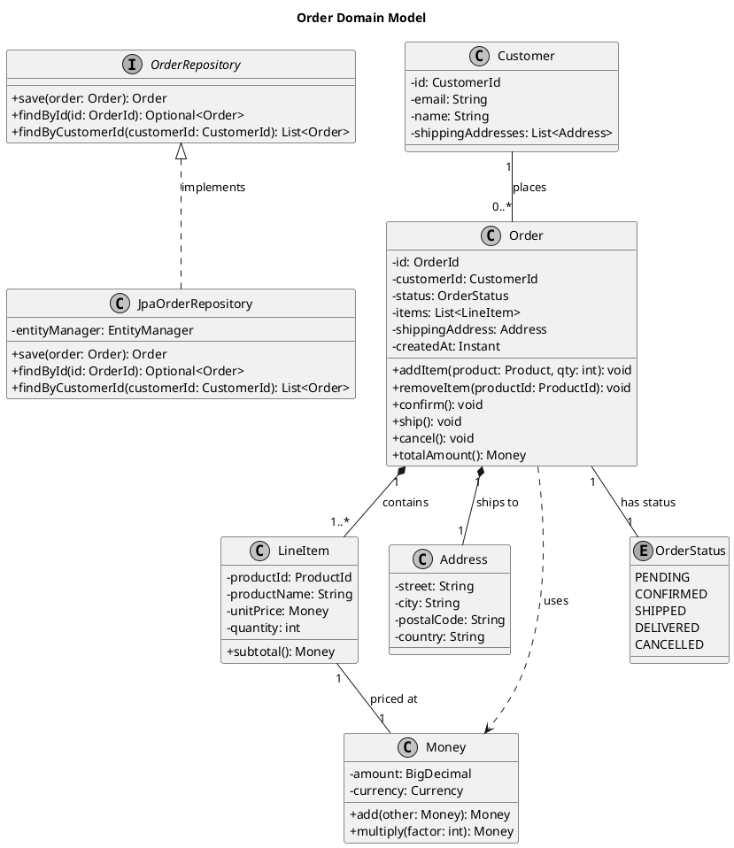
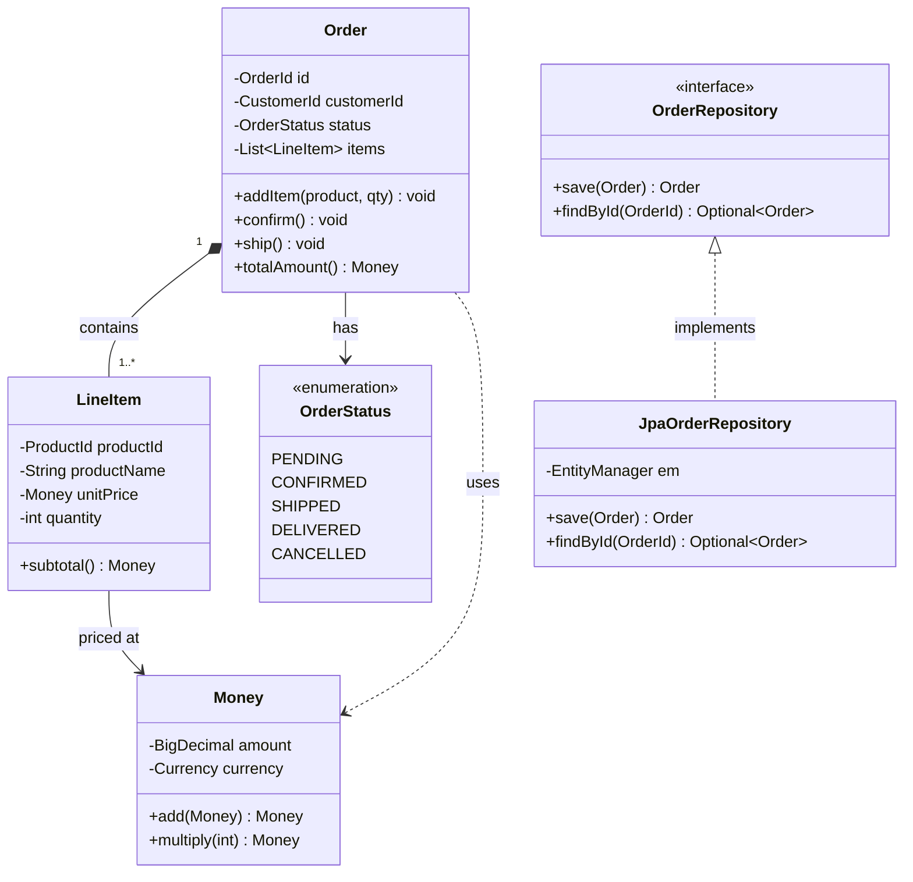
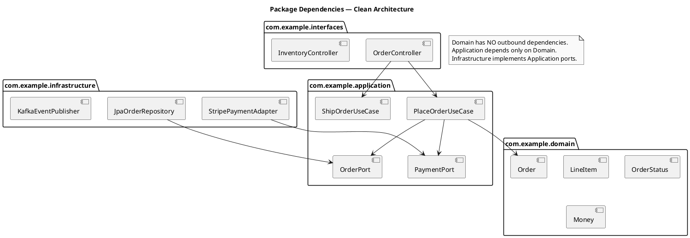
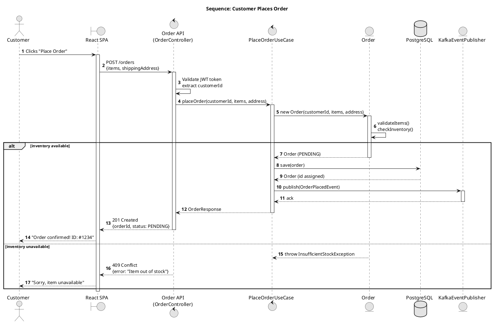
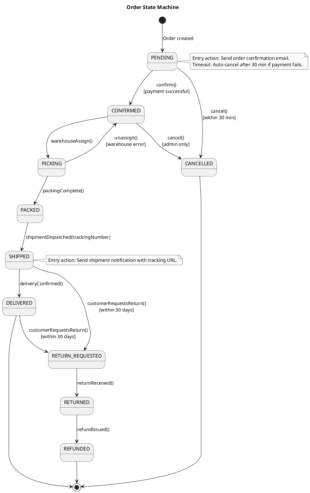
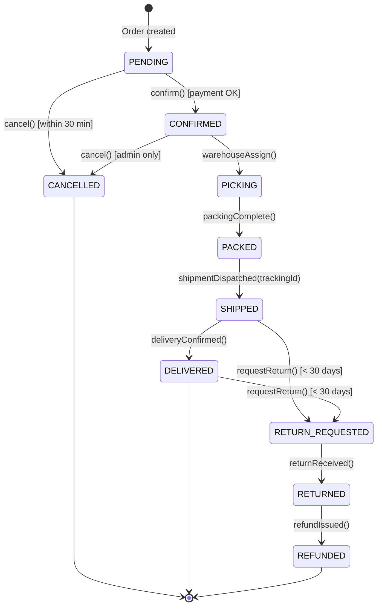
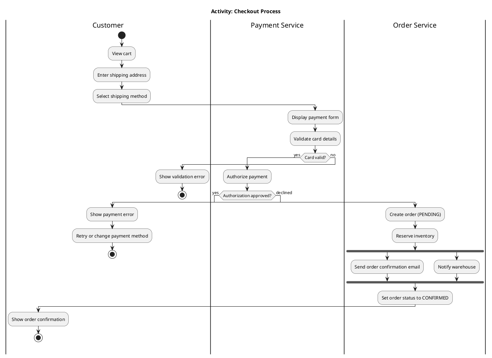
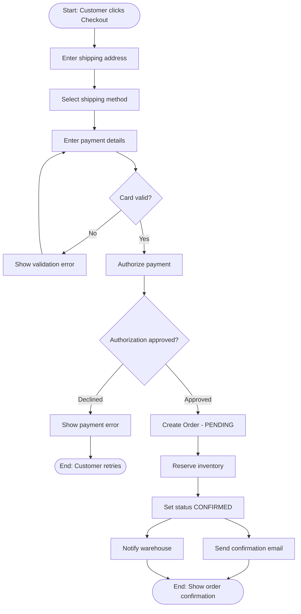
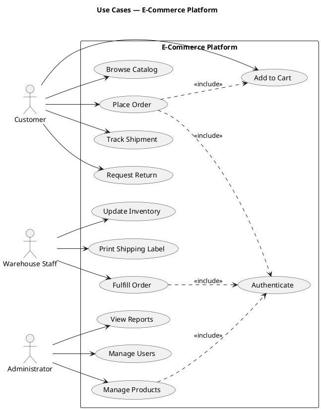
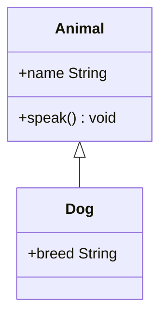

# UML Diagrams — Practical Reference

UML (Unified Modeling Language) is a standardized notation for visualizing software designs. Use the right diagram type for the question you're answering. This skill covers the diagrams you will actually use: class, sequence, state machine, activity, use case, and package.

---

## Diagram Selection Guide

```
What are you documenting?
│
├── Static structure (what exists)
│   ├── Domain model, class relationships, API contracts → Class Diagram
│   ├── Module / package dependencies                   → Package Diagram
│   └── Replaceable components with provided/required interfaces → Component Diagram
│
└── Dynamic behavior (what happens)
    ├── Message flow between objects/services            → Sequence Diagram
    ├── Business process, algorithm steps, workflow      → Activity Diagram
    ├── Object lifecycle (states an entity moves through)→ State Machine Diagram
    └── User requirements / scope definition             → Use Case Diagram
```

---

## Structural Diagrams

### Class Diagram

**Purpose:** Model domain entities, their attributes, methods, and the relationships between them.

**When to use:**
- Explaining a domain model to a new team member
- Designing an API contract before implementation
- Documenting a design pattern implementation
- Architecture review: does the code structure match the design?

#### Notation Reference

```
Visibility:
  +  public
  -  private
  #  protected
  ~  package (default)

Class box:
  ┌─────────────────────┐
  │    ClassName        │  ← name (bold)
  ├─────────────────────┤
  │ - attribute: Type   │  ← attributes
  │ # count: int        │
  ├─────────────────────┤
  │ + method(): void    │  ← methods
  │ + find(id): Order   │
  └─────────────────────┘

Interface (<<interface>> stereotype or lollipop notation):
  ┌─────────────────────┐
  │   <<interface>>     │
  │   OrderRepository   │
  ├─────────────────────┤
  │ + save(o: Order)    │
  │ + findById(id): Order│
  └─────────────────────┘
```

#### Relationship Types — ASCII

```
Association    A has a reference to B (navigable)
  Customer ──────────────> Order

Aggregation    B can exist without A (weak ownership)
  Team ◇────────────────> Player

Composition    B cannot exist without A (strong lifecycle ownership)
  Order ◆────────────────> LineItem

Inheritance    B extends A (is-a relationship)
  Animal <|──────────────── Dog

Implementation B implements interface A
  OrderRepository <|·········· JpaOrderRepository

Dependency     A uses B transiently (in a method parameter or local var)
  OrderService ·············> EmailService

Multiplicity notation:
  1        exactly one
  0..1     zero or one
  *        zero or many
  1..*     one or many
  2..5     specific range
```

#### PlantUML — Class Diagram (E-Commerce Domain)



#### Mermaid — Class Diagram



---

### Package Diagram

**Purpose:** Show module/package dependencies. Detect circular dependencies before they become problems.

**When to use:**
- Enforcing Clean Architecture or Hexagonal Architecture boundaries
- Visualizing which modules are allowed to depend on which
- Identifying dependency cycles



---

## Behavioral Diagrams

### Sequence Diagram

**Purpose:** Show message exchanges between participants (actors, systems, objects) over time. The vertical axis is time; each participant has a lifeline.

**When to use:**
- API interaction flows (what calls what, in what order)
- Use case walkthroughs (step-by-step system behavior)
- Microservice choreography (who publishes, who consumes)
- Debugging: documenting what actually happened in an incident

#### Notation Reference

```
Participants:
  actor     Human user (stick figure)
  boundary  System boundary / UI
  control   Orchestrator / use case
  entity    Domain object / database

Message types:
  ->        Synchronous call (solid arrow)
  -->       Return message (dashed arrow)
  ->>       Asynchronous message (no wait for response)
  -->>      Async return

Combined fragments:
  alt       if/else (like a switch)
  opt       optional (executes only if condition true)
  loop      repetition
  par       parallel execution
  ref       reference to another diagram

Activation bars: narrow rectangle on lifeline = object is active
```

#### PlantUML — Sequence Diagram: Place Order Flow



#### Mermaid — Sequence Diagram

```mermaid
sequenceDiagram
  autonumber
  actor Customer
  participant SPA as React SPA
  participant API as Order API
  participant UC as PlaceOrderUseCase
  participant DB as PostgreSQL
  participant Kafka

  Customer->>SPA: Clicks "Place Order"
  SPA->>API: POST /orders {items, address}
  activate API
  API->>API: Validate JWT
  API->>UC: placeOrder(customerId, items, address)
  activate UC

  alt inventory available
    UC->>DB: save(order)
    DB-->>UC: Order{id, status: PENDING}
    UC->>Kafka: publish(OrderPlacedEvent)
    Kafka-->>UC: ack
    UC-->>API: OrderResponse
    deactivate UC
    API-->>SPA: 201 Created {orderId}
    deactivate API
    SPA-->>Customer: "Order confirmed #1234"
  else inventory unavailable
    UC-->>API: 409 InsufficientStock
    deactivate UC
    deactivate API
    SPA-->>Customer: "Item unavailable"
  end
```

---

### State Machine Diagram

**Purpose:** Document all states an entity can be in, the events that trigger transitions, and optional guards and actions.

**When to use:**
- Order lifecycle (PENDING → CONFIRMED → SHIPPED → DELIVERED)
- Payment state machine
- Connection state machine (DISCONNECTED → CONNECTING → CONNECTED → ERROR)
- User account status
- Any entity where invalid state transitions cause bugs

#### Notation Reference

```
[*]         Initial state (filled circle) or final state
State       Rectangle with rounded corners
Transition  Labeled arrow: event [guard] / action
```

#### PlantUML — Order State Machine



#### Mermaid — State Machine



---

### Activity Diagram

**Purpose:** Flowchart-style diagram showing steps in a process, with decisions (diamonds), parallel execution (fork/join bars), and swimlanes to show which actor performs each action.

**When to use:**
- Business process documentation (checkout flow, return flow)
- Algorithm steps (especially with branching and parallel steps)
- Workflow documentation with multiple actors

#### PlantUML — Activity Diagram with Swimlanes: Checkout Process



#### Mermaid — Flowchart (Activity-style)



---

### Use Case Diagram

**Purpose:** Show what the system does (use cases) and who does it (actors). Not for technical design — for scope definition and stakeholder alignment.

**When to use:**
- Project kickoff: defining system scope
- Stakeholder sign-off on features
- Identifying actors and their goals

**Keep minimal.** Use cases are ovals with verb phrases ("Place Order", "Track Shipment"). Never use Use Case diagrams to show technical implementation.



---

## PlantUML in Practice

```bash
# Render locally
java -jar plantuml.jar diagram.puml        # outputs diagram.png
java -jar plantuml.jar -tsvg diagram.puml  # outputs diagram.svg
java -jar plantuml.jar -tpdf diagram.puml  # outputs diagram.pdf

# Render all .puml files in a directory
java -jar plantuml.jar docs/diagrams/*.puml

# Use PlantUML server (Docker)
docker run -d -p 8080:8080 plantuml/plantuml-server:jetty

# CI: generate PNGs and commit alongside source
# GitHub Actions example:
# - uses: cloudbees/plantuml-github-action@master
```

**VS Code:** Install "PlantUML" extension by jebbs. `Alt+D` to preview.

**Embed in Markdown:**
```markdown

```
Use the PlantUML online server to generate PNG URLs, or use [kroki.io](https://kroki.io) as a proxy.

---

## Mermaid in Practice

Native support in: **GitHub Markdown, GitLab, Notion, Obsidian, Confluence (with plugin), HackMD, Azure DevOps**.

```markdown

```

**Diagram types:**
```
classDiagram       → Class diagram
sequenceDiagram    → Sequence diagram
stateDiagram-v2    → State machine
flowchart TD/LR    → Activity / flowchart (TD=top-down, LR=left-right)
erDiagram          → Entity-relationship
C4Context          → C4 Level 1 (via C4 plugin)
C4Container        → C4 Level 2
gitGraph           → Git branching visualization
```

**Limitations vs PlantUML:**
- Less expressive for complex sequence fragments (`alt`/`loop` less powerful)
- No swimlane support in activity/flowchart
- Limited styling options
- Class diagram notation less complete (no package, no component)
- Mermaid's advantage: zero setup in GitHub/GitLab

---

## Anti-Patterns

| Anti-Pattern | Problem | Fix |
|---|---|---|
| Class diagram with every class | Diagram becomes noise; readers can't find the important relationships | Model only the concepts central to the design decision you're communicating |
| Sequence diagram without activation bars | Unclear when objects are active; concurrent calls become ambiguous | Use `activate`/`deactivate` or the shorthand `++`/`--` in PlantUML |
| State diagram with missing transitions | Implies illegal state transitions don't exist, leading to bugs | Every state needs every possible event handled (even if "ignore") |
| UML class diagram for system architecture | Wrong abstraction level and wrong audience | Use C4 Container/Component diagrams instead |
| Mixing relationship types | Composition arrows used for association, etc. | Standardize on one notation and document it in the team wiki |
| Arrows without multiplicity | "Has" could mean 1 or 1000 — matters for performance and design | Always add multiplicity to both ends of every association |
| Diagram rot | Diagrams committed as PNG, source never updated | Commit source (`.puml`, `.mermaid`), generate PNG in CI; or use living tools |

---

## Quick Reference — PlantUML Class Relationships

```plantuml
' Association (A navigates to B)
A --> B

' Aggregation (weak: B can exist without A)
A o-- B

' Composition (strong: B lifecycle owned by A)
A *-- B

' Inheritance (B is-a A)
A <|-- B

' Interface implementation (B implements A)
A <|.. B

' Dependency (A uses B transiently)
A ..> B

' With multiplicity
A "1" *-- "1..*" B : contains

' With role labels
A "owner" --> "pet 0..*" B
```

## Quick Reference — PlantUML Sequence Messages

```plantuml
A -> B : Synchronous call
A --> B : Return (dashed)
A ->> B : Async (no block)
A -->> B : Async return

activate A
deactivate A

alt condition
    A -> B : message
else other
    A -> C : message
end

loop for each item
    A -> B : process(item)
end

opt if condition is true
    A -> B : optional call
end
```
